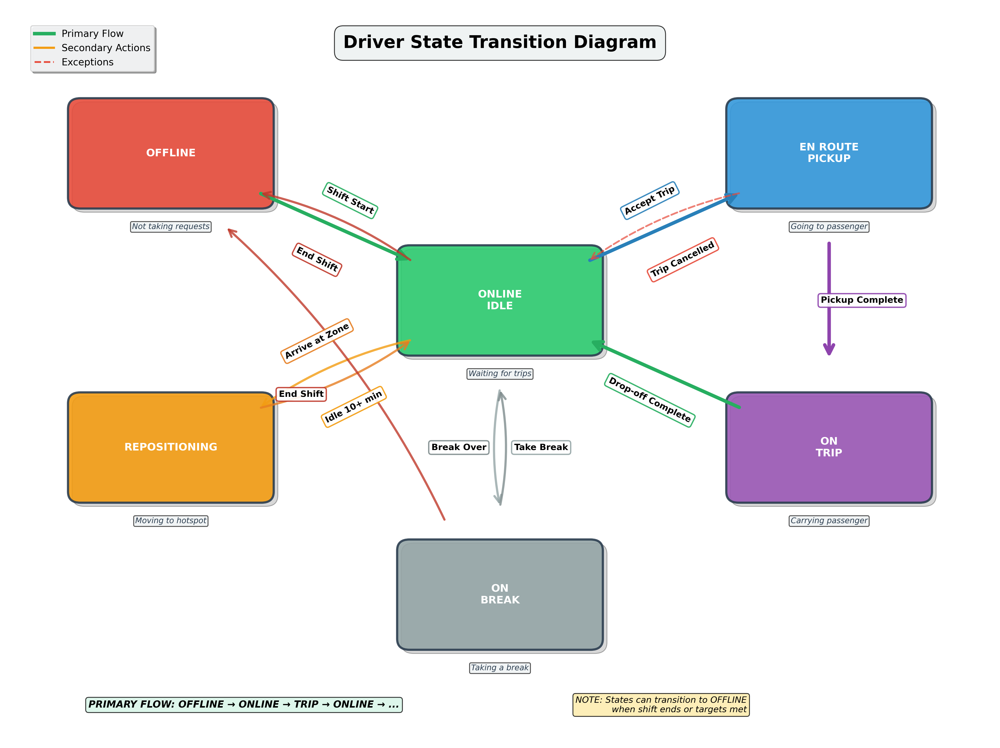
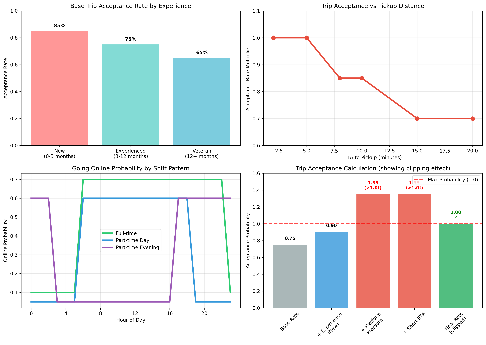

# Enhanced Driver Dynamics Documentation

## Overview

The Enhanced Driver Dynamics system models realistic rideshare driver behavior using research-based patterns and decision-making processes. It extends basic simulation models with complex driver states, behavioral patterns, and data-driven decision engines.

## Core Components

### Driver States (enhanced_driver_dynamics.py:20-27)

The system uses six distinct driver states:

- **OFFLINE**: Driver not available for requests
- **ONLINE_IDLE**: Driver online and waiting for requests  
- **EN_ROUTE_PICKUP**: Driver traveling to pick up passenger
- **ON_TRIP**: Driver with passenger onboard
- **REPOSITIONING**: Driver moving to better location
- **ON_BREAK**: Driver temporarily unavailable

### Driver Profiles (enhanced_driver_dynamics.py:45-58)

Each driver has a static profile containing:

#### Experience Levels
- **NEW** (0-3 months): High acceptance rate, learning behavior
- **EXPERIENCED** (3-12 months): Balanced decision-making
- **VETERAN** (12+ months): Selective, optimized behavior

#### Shift Patterns
- **FULL_TIME**: 6 AM - 10 PM, ~10 hours/day
- **PART_TIME_DAY**: 6 AM - 6 PM, ~6 hours/day  
- **PART_TIME_EVE**: 5 PM - 2 AM, ~6 hours/day
- **WEEKEND**: 10 AM - 12 AM, weekends only

#### Key Attributes
- Home location and preferred work zones
- Daily hours and earnings targets
- Multi-platform usage (17% of drivers)
- Baseline acceptance rates by experience
- Vehicle capacity

### Dynamic State Tracking (enhanced_driver_dynamics.py:60-86)

The system tracks real-time driver metrics:

#### Session Data
- Current online session duration
- Daily earnings accumulated
- Trips completed today
- Session start times

#### Decision Factors
- Consecutive trip rejections
- Time since last trip
- Last break timing
- Multi-platform request conflicts

#### Trip Management
- Current trip assignments
- Pickup/dropoff locations
- Request routing state

## Decision Engine (enhanced_driver_dynamics.py:221-372)

### Going Online Decision (enhanced_driver_dynamics.py:228-283)

Drivers decide to go online based on:

1. **Shift Pattern Alignment**: Must be within preferred shift hours
2. **Daily Limits**: Under hours and earnings targets
3. **Market Conditions**: Surge multiplier affects attractiveness
4. **Base Probability**: 70% likelihood when conditions met

The decision is vectorized across all drivers using JAX for performance.

### Trip Acceptance Decision (enhanced_driver_dynamics.py:285-342)

Acceptance probability factors:

1. **Experience Level**:
   - New drivers: 120% of baseline (eager to work)
   - Experienced: 100% of baseline
   - Veteran: 90% of baseline (more selective)

2. **Distance Penalty**:
   - >10 min ETA: 70% acceptance
   - 5-10 min ETA: 85% acceptance
   - <5 min ETA: 100% acceptance

3. **Platform Pressure**: 
   - 3+ consecutive rejections: 150% acceptance boost
   
4. **Multi-Platform Competition**:
   - Existing request on other platform: 70% acceptance

### Repositioning Decision (enhanced_driver_dynamics.py:344-372)

Drivers reposition when:
- Currently idle online
- 10+ minutes since last trip
- Market demand/supply imbalance detected
- 10% base probability per decision cycle

## Realistic Behavior Patterns

### Research-Based Distributions

The system uses real-world data distributions:

- **Experience**: 25% new, 45% experienced, 30% veteran
- **Shift Types**: 15% full-time, 35% day, 30% evening, 20% weekend
- **Multi-Platform**: 17% use multiple platforms
- **Preferred Zones**: 3-5 zones per driver

### Earnings and Hours Targets

Targets vary by shift pattern and experience:

- **Full-time**: $200/day, 10 hours
- **Part-time day**: $120/day, 6 hours  
- **Part-time evening**: $130/day, 6 hours (higher rates)
- **Weekend**: $150/day, 8 hours

Experience modifies targets:
- New drivers: 80% of base expectations
- Veteran drivers: 120% of base expectations

## Integration Points

### JAX/Flax Integration

The system uses:
- **JAX arrays** for vectorized operations
- **Flax structs** for immutable state management
- **Random keys** for reproducible stochastic decisions
- **Vectorized functions** for parallel driver processing

### Market State Interface

The decision engine expects market conditions:
```python
market_conditions = {
    'surge_multiplier': 1.2,
    'demand_by_zone': {zone_id: demand_level},
    'supply_by_zone': {zone_id: supply_level}
}
```

### State Transitions

The system handles complex state transitions with specific triggers and conditions:



**Transition Details:**
- **Offline → Online**: Triggered by shift start time + favorable market conditions
- **Online Idle → En Route**: Trip acceptance based on distance, experience, platform pressure
- **En Route → On Trip**: Automatic when passenger pickup is completed
- **On Trip → Online Idle**: Automatic when passenger is dropped off
- **Online Idle → Repositioning**: After 10+ minutes idle with demand imbalance
- **Online Idle → Break**: Based on fatigue models and scheduled breaks
- **Any State → Offline**: End of shift or when daily targets are met

**Decision Probability Factors:**



The plots above show how various factors influence driver decisions:
1. **Experience Impact**: New drivers have 85% base acceptance, veterans 65%
2. **Distance Sensitivity**: Acceptance drops significantly for pickups >10 minutes away
3. **Shift Patterns**: Different online probability curves for each shift type
4. **Cumulative Effects**: How multiple factors combine to determine final acceptance rates

## Performance Characteristics

### Scalability
- Handles 300+ drivers efficiently
- Vectorized operations across all drivers
- O(n) complexity for most decisions
- JAX compilation for optimized execution

### Realism Factors
- Multi-platform competition effects
- Fatigue and break scheduling
- Experience-based learning curves
- Geographic preference patterns
- Economic target optimization

## Usage Example

```python
# Initialize system
driver_manager = EnhancedDriverManager(300, historical_data)
decision_engine = DriverDecisionEngine(driver_manager)
driver_state = driver_manager.initialize_state(jax.random.PRNGKey(42))

# Simulation step
current_time = 8 * 3600  # 8 AM
market_conditions = {'surge_multiplier': 1.2}

# Driver decisions
go_online = decision_engine.should_go_online(
    current_time, driver_state, market_conditions, key
)
accept_trip = decision_engine.should_accept_trip(
    trip_request, driver_state, key
)
should_reposition, target_zones = decision_engine.should_reposition(
    driver_state, market_state, key
)
```

## Next Development Steps

1. **State Transition Engine**: Complete driver state updates
2. **Earnings Tracking**: Implement detailed revenue calculation
3. **Break Management**: Add fatigue and mandatory break logic
4. **Validation**: Compare against real driver behavior data
5. **Performance Optimization**: Further JAX compilation improvements